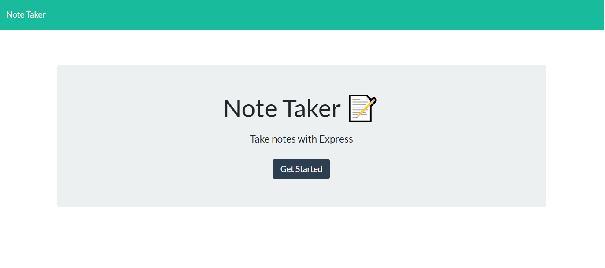

# Note Taker  
    
    
MIT
Copyright (c) [2020] [Austyn Whaley]

---

### Table of Contents

- [Description](#description)
- [Installation](#installation)
- [Usage](#usage)
- [Testing](#Testing)
- [Contribution](#Contribution)
- [Questions](#Questions)
    

---

## Description

### This is an application that saves and stores typed notes to a data base and which is displayed. You are also able to delete these created notes from the interface.

---

## Installation

### To install this program you will need to run

#### no installation required

---

## Usage

### Usage for this application:

#### To take down notes and save them in real time.

---

## Testing

### How to test application:

#### Type a title and some text into the input fields and click the save button and once it is saved you can delete them by clicking on the delete icon

---

## Contribution

### The guidelines for contributon to this application are as follows:

#### There are no contributions.

---

## Questions

Any questions regarding the application can be answered at:

[Link to Github](https://github.com/austynwhaley/)
##### Email: austyn_whaley@yahoo.com
    
